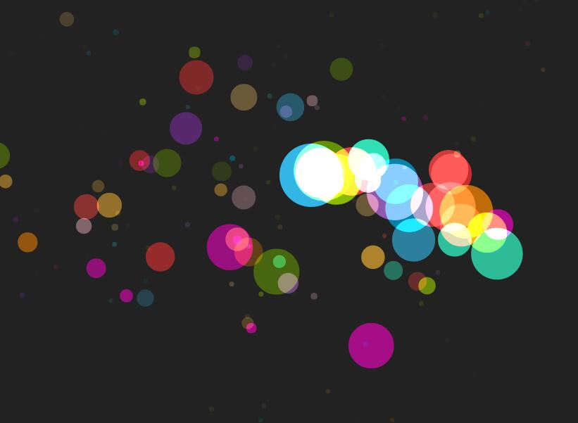
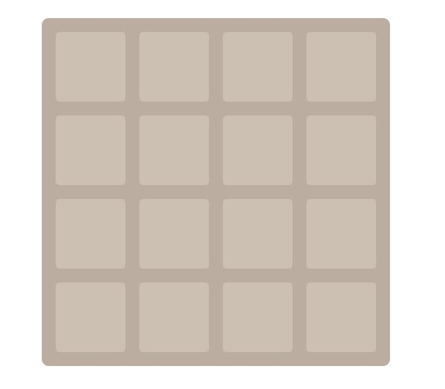

# Canvas画彩色泡泡

[这里看视频](https://www.bilibili.com/video/av19171469/#page=3)

### 知识
要用企业级开发思想，为有利于后期维护写代码，封装好变量，不要让外部使用。

泡泡由鼠标移动产生。效果截图：

# Canvas画圆角矩形

### 上传原因
感觉整个代码封装的很优雅，易于该需求，增填功能，应该多写这样的代码。

